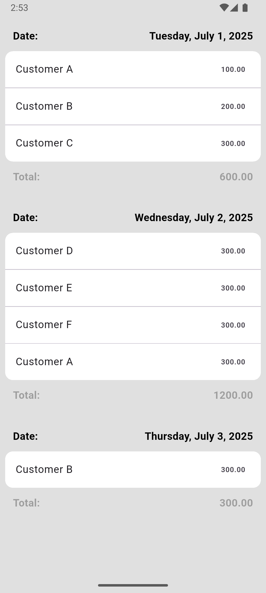

# list_project

Тестовое прилоежение для просмотра данных по дням
Написано на Flutter

## Использованные технологии
- flutter_bloc (управление состоянием)
- get_it (DI)
- intl (изменение формата дат )

